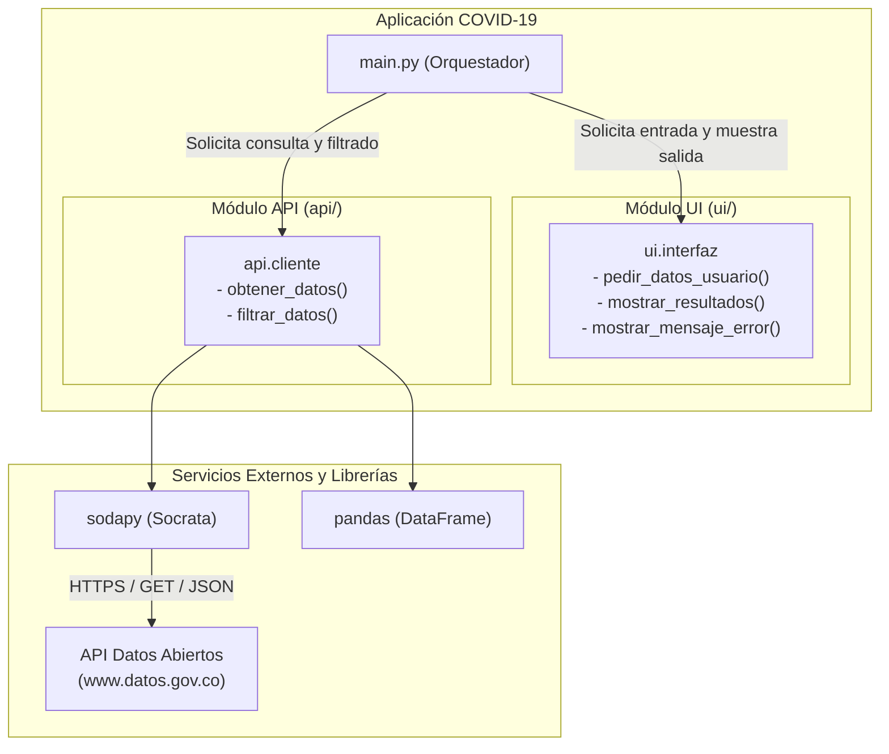

# Proyecto: Fundamentos Básicos de Python - Consulta API COVID-19 Colombia

**Universidad Tecnológica de Pereira**  
**Docente:** Alejandro Rodas Vásquez  
**Materia:** Programación 3  
**Estudiante:** Santiago Guerra  

---

## 1. Descripción del Proyecto

Aplicación en Python estructurada bajo una **Arquitectura de Software Modular** que consume la API de Datos Abiertos de Colombia (`www.datos.gov.co`), específicamente el conjunto de datos de casos positivos de COVID-19 (`gt2j-8ykr`), empleando las librerías `sodapy` y `pandas`.

La aplicación permite al usuario ingresar:
- El nombre del **Departamento** a consultar (`nombre_departamento`).
- El **Límite de registros** a obtener (`limite_registros`).

Y presenta en pantalla los resultados formateados de manera alineada y legible utilizando la función `format` de Python, conteniendo exclusivamente las 6 columnas solicitadas:
1. **Ciudad de ubicación**
2. **Departamento**
3. **Edad**
4. **Tipo**
5. **Estado**
6. **País de procedencia**

---

## 2. Marco Teórico: Arquitectura de Software y Diagramas de Componentes

### 2.1 ¿Qué es un Componente?
En la arquitectura y diseño de software, un **componente** es una unidad modular, autónoma y reemplazable de un sistema que encapsula su estado y comportamiento interno. Un componente expone una o más interfaces bien definidas a través de las cuales interactúa con otros componentes o módulos, ocultando los detalles de su implementación (principio de encapsulamiento y bajo acoplamiento).

### 2.2 ¿Qué es un Diagrama de Componentes?
Un **Diagrama de Componentes** es un tipo de diagrama estructural perteneciente a UML (Unified Modeling Language). Representa visualmente la organización de alto nivel del sistema de software, mostrando cómo se dividen las responsabilidades en diferentes componentes de software, bibliotecas, ejecutables, módulos o servicios, y las dependencias o conexiones existentes entre ellos mediante interfaces provistas y requeridas.

### 2.3 ¿Para qué se utiliza?
El diagrama de componentes se utiliza para:
- **Visualizar la arquitectura física y lógica** de un sistema complejo.
- **Modelar subsistemas y paquetes modulares**, asegurando que cada módulo tenga una responsabilidad única (Principio de Responsabilidad Única - SRP).
- **Gestionar dependencias**, facilitando el mantenimiento, reutilización y pruebas unitarias de cada parte de manera independiente.
- **Planificar despliegues y configuración** de software, permitiendo a los desarrolladores y arquitectos entender qué piezas dependen de qué servicios externos (por ejemplo, librerías de terceros o APIs web).

### 2.4 Diagrama de Componentes del Proyecto



---

## 3. Estructura del Proyecto

El software aplica estrictamente la arquitectura modular requerida en la guía:

```
modulo_1.py/ (o ProyectoAPI/)
├── api/
│   ├── __init__.py           # Inicializador del paquete api
│   └── cliente.py            # Lógica de conexión con Socrata, consulta y filtrado de datos
├── ui/
│   ├── __init__.py           # Inicializador del paquete ui
│   └── interfaz.py           # Captura de datos del usuario y renderizado de tablas con format
├── venv/                     # Entorno virtual de Python con sodapy y pandas
├── .gitignore                # Archivos y carpetas ignoradas por git (venv, pycache)
├── main.py                   # Archivo principal ejecutable que orquesta los módulos
├── README.md                 # Documentación técnica y fundamento teórico
└── requirements.txt          # Dependencias del proyecto
```

---

## 4. Instalación y Ejecución

### 4.1 Requisitos Previos
- Python 3.9 o superior instalado en el equipo.

### 4.2 Pasos de Instalación
1. Clonar el repositorio o ingresar a la carpeta del proyecto:
   ```bash
   cd "ruta/al/proyecto"
   ```

2. Crear y activar el entorno virtual (`venv`):
   - En **macOS / Linux**:
     ```bash
     python3 -m venv venv
     source venv/bin/activate
     ```
   - En **Windows**:
     ```bash
     python -m venv venv
     venv\Scripts\activate
     ```

3. Instalar las dependencias:
   ```bash
   pip install -r requirements.txt
   ```

4. Ejecutar la aplicación:
   ```bash
   python main.py
   ```

---

## 5. Ejemplos de Funcionamiento y Evidencias

### Consulta 1: Departamento de Risaralda (5 registros)
```
============================================================
       CONSULTA DE CASOS COVID-19 EN COLOMBIA
============================================================
 Ingrese el nombre del Departamento a consultar: Risaralda
 [i] Nota: Ingrese un valor razonable (ej. 10 a 500).
     Consultar números muy altos (>1000) puede demorar o colgar la consulta.
 Ingrese el número de registros a obtener: 5

[+] Consultando los últimos 5 casos para 'Risaralda' en datos.gov.co...

==================================================================================================
 RESULTADOS DE LA CONSULTA: RISARALDA (5 registros)
==================================================================================================
Ciudad de ubicación   | Departamento   | Edad   | Tipo          | Estado   | País de procedencia  
==================================================================================================
BELEN DE UMBRIA       | RISARALDA      | 81     | Comunitaria   | Leve     | Colombia             
SANTA ROSA DE CABAL   | RISARALDA      | 64     | Comunitaria   | Leve     | Colombia             
SANTA ROSA DE CABAL   | RISARALDA      | 40     | Comunitaria   | Leve     | Colombia             
PEREIRA               | RISARALDA      | 20     | Comunitaria   | Leve     | Colombia             
SANTA ROSA DE CABAL   | RISARALDA      | 20     | Comunitaria   | Leve     | Colombia             
--------------------------------------------------------------------------------------------------
 Total de casos mostrados: 5
==================================================================================================
```

### Consulta 2: Departamento de Antioquia (6 registros)
```
==================================================================================================
 RESULTADOS DE LA CONSULTA: ANTIOQUIA (6 registros)
==================================================================================================
Ciudad de ubicación   | Departamento   | Edad   | Tipo          | Estado   | País de procedencia  
==================================================================================================
ENVIGADO              | ANTIOQUIA      | 37     | Comunitaria   | Leve     | Colombia             
ENVIGADO              | ANTIOQUIA      | 37     | Comunitaria   | Leve     | Colombia             
ITAGUI                | ANTIOQUIA      | 36     | Comunitaria   | Leve     | Colombia             
ENVIGADO              | ANTIOQUIA      | 63     | Comunitaria   | Leve     | Colombia             
MEDELLIN              | ANTIOQUIA      | 52     | Comunitaria   | Leve     | Colombia             
MEDELLIN              | ANTIOQUIA      | 22     | Comunitaria   | Leve     | Colombia             
--------------------------------------------------------------------------------------------------
 Total de casos mostrados: 6
==================================================================================================
```

---

## 6. Instrucciones para Subir a GitHub

Para cumplir con el requerimiento de entrega en el repositorio individual de GitHub:

1. Inicializar git en la carpeta del proyecto (si no está inicializado):
   ```bash
   git init
   ```
2. Agregar los archivos:
   ```bash
   git add .
   ```
3. Realizar el commit inicial:
   ```bash
   git commit -m "Implementación de arquitectura modular para consulta API COVID-19 Colombia"
   ```
4. Vincular el repositorio remoto de GitHub:
   ```bash
   git branch -M main
   git remote add origin https://github.com/<TU_USUARIO>/<TU_REPOSITORIO>.git
   git push -u origin main
   ```
